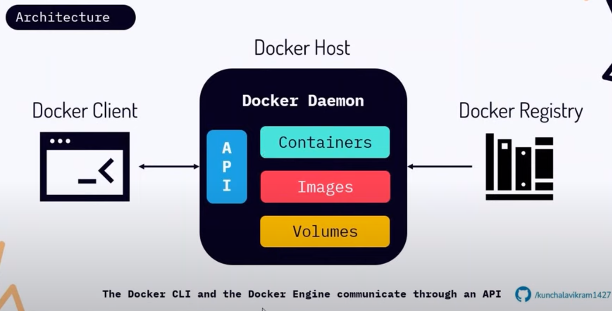
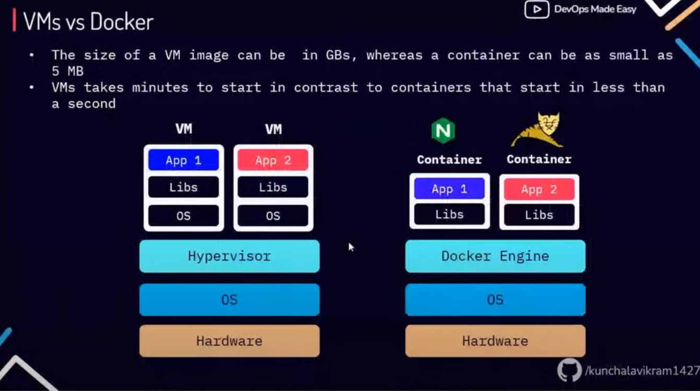

# Docker


### What is docker 
Docker is a platform that enables developers to develop, ship, and run applications in containers. Containers are lightweight, standalone, and executable packages that include everything needed to run an application: code, runtime, system tools, libraries, and settings.

### Explain Docker architecture and its components:

docker has 2 components:
* docker-cli
* docker-daemon




### what is hypervisor
A hypervisor is a software that makes virtualization possible, it divides the host system and allocations the resources to each divided virtual environment, you can basically have multiple os on a single host system.
there are two types of hypervisor:
* type1: it also called native hypervisor or bare metal hypervisor. it runs directly on the underlying host system. It has direct access to your hosts system hardware and hence does not require a base server operating system. Example of  type one hypervisor is : Esxi, hyper-v, kvm.

* type2: this kind of hypervisor makes use of underlying host operating system, is also called hosted hypervisor. Example: viraualbox, vmware-workstation.

### what is virtualization

Virtualization is a technology that allows you to create multiple virtual instances of physical hardware resources, such as servers, storage devices, or network resources, on a single physical machine. These virtual instances, known as virtual machines (VMs) or virtual environments, operate independently from each other and from the underlying physical hardware.


### what is containerization
Containerization is a lightweight form of virtualization that allows you to package and run applications and their dependencies in isolated environments called containers. Containers are self-contained units that include everything needed to run an application, such as code, runtime, system tools, libraries, and settings.

### What is difference between VMs and Docker




### what is docker image

It is a template that will have all the dependencies along with your application binaries.

### what is docker container
running instance of a docker image, or is an isolated process running in an isolated environment created by cgroups and namespace. the processes running within this container are visible to your host machine, but the process that runs in host machine is not visible in docker container.

### what is cgroups & namespace
namespace provide the container necessary resources like storage, network, file system, ...
cgroups provide resources like RAM, CPU. so with cgroups and namespaces your container are usually created.


### what is container Runtime environment
container runtime environment is also known as container engine which is responsible for creating containers. container Runtime uses cgroups and namespaces to create isolated environment for running containers.


### some important docker command

```

docker --version
docker version
docker info
docker system df
docker system prune
docker volume prune

docker run -tid --name myweb-server -p 80:80 hub.hamdocker.ir/nginx:alpine
docker ps 
docker ps -a
docker logs -f myweb-server
docker stop myweb-server
docker kill myweb-server


docker image inspect image_name
docker login https://hub.docker.com

usermod -aG docker <USER>
newgrp docker

docker cp <host_address> container_name:/tmp  #copy a file from host to a container
docker cp container_name:/tmp/web.conf .      # copy a file from container to host


# backup
tar -zcvf docker-backup-$(date +%s).tar.gz /var/lib/docker


docker stats
docker top container_name


docker container run --name container_name -e test=devops -e pass=password nginx:latest
docker run --name container_name --env-from=env.txt nginx:latest


docker network create net1
docker network create net2

docker run -itd --name web1 --net net1 nginx:latest
docker run -itd --name web2 --net net2 nginx:latest

docker network connect net1 web2


```

### Setup Harbor 
```
wget https://github.com/goharbor/harbor/releases/download/v2.12.2/harbor-offline-installer-v2.12.2.tgz


```


### how do you check the total size occupied by docker home

```
docker system df


```

### what is difference between docker stop and kill
docker stop will give 10 seconds of time for stop a container(gracefully terminated) but docker kill imadiately sent SIGKILL(kill -9) a container.


### what is Dockerfile
Its a set of instructions that builds a docker image.


###  what is .dockerignore
when you try to build a docker image from dockerfile, the content in .dockerignore will ignore to send these file to docker daemon.


### what is difference between ADD and COPY
COPY only use local file system but ADD can download from remote server(ADD can be copy a tar or a zip file and untar o r unzip them when copying.)


### what is difference between CMD and ENTRYPOINT
both CMD and ENTRYPOINT defines the starting of your docker container.

### what is difference between RUN and CMD
RUN run when building image, but CMD run when running a container


#### Tip
```

ARG TAG
FROM nginx:$TAG

docker build --build-arg TAG=1.4 -t web:ver1 .
```


### Can we have multiple CMD in Dockerfile
yes, but last one will run when we start a container.


### what is docker network
it will enable networking between your containers. whenever you install docker, docker0(bridge) will create.


```
docker network create net1
docker network create net2

docker network connect net1 container_name

```


### is docker compose is a production tools?
no, the production tools is docker swarm or kubernetes.


### Is it possible use json instead of yaml for writing docker compose?
yes, we can use it. but we have to specify the filename with the following command:

```
docker-compose -f docker-compoes.jso up -d

```